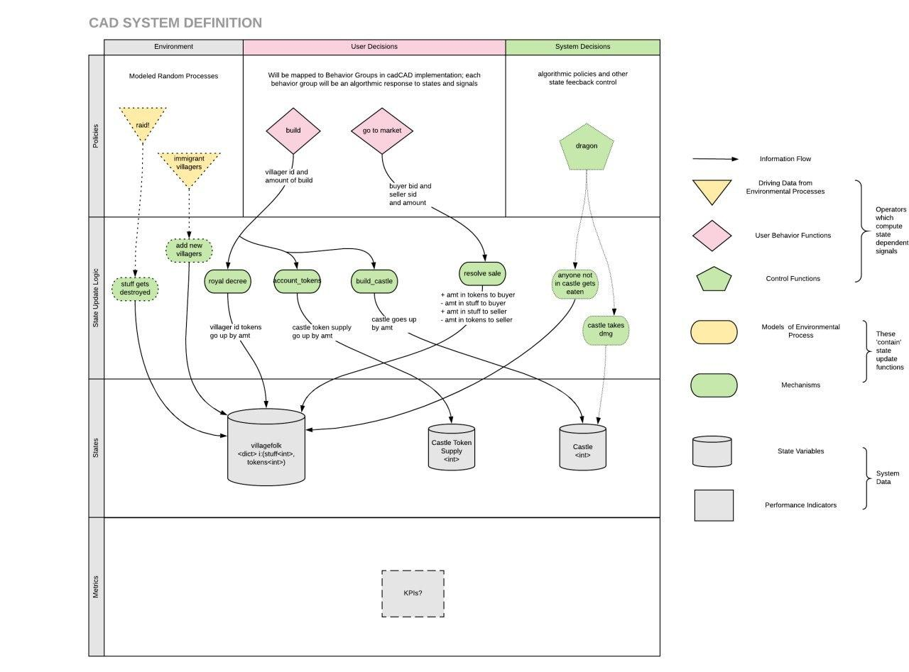

# CredCastle

> An awesome castle in CredLand!

CredCastle is a magical land where villagers can contribute to building a castle, and when they do they earn Castle tokens. These tokens give people the right to be in the castle. This is very handy when it's cold outside or the neighboring village decides to raid. Castle tokens can be bought and sold in the village market.

Village folk make decisions (pink diamonds). Once they make a decision, they then do stuff (green ovals). Doing stuff changes the state of CredLand (grey cylinders). Environmental variables such as the liklihood of a raid and the comfort of being inside in the winter might the preferences of village folk, but they might not. You decide!

If you have questions please ask them in the [TE 101 chat](https://t.me/te101stuff). We'll do our best to answer questions and help you out.

 

## Preparing for your journey

Before you venture off into to land of cred, you'll need to understand a few things. First, creating a diagram can help a lot with getting intuition right. The clearer your thinking, the better your cadCAD. Get familiar with the [cadCAD differential spec](https://community.cadcad.org/t/differential-specification-syntax-key/31) and practice sketching your systems out in this format. It will make it 10X easier to then create a cadCAD model to explore it.

 

## Starting your adventure

To enter CredLand you will want to [install CadCAD](https://github.com/BlockScience/cadCAD). We recommend [reading the docs](https://github.com/cadCAD-org/cadCAD/tree/master/documentation). From there, the [Robots and marbles tutorial](https://github.com/BlockScience/cadCAD/blob/master/tutorials/robot-marbles-part-1/robot-marbles-part-1.ipynb) can help you get familiar with CadCAD basics ([video tutorial here](https://www.youtube.com/watch?v=uJEiYHRWA9g&feature=youtu.be)).
